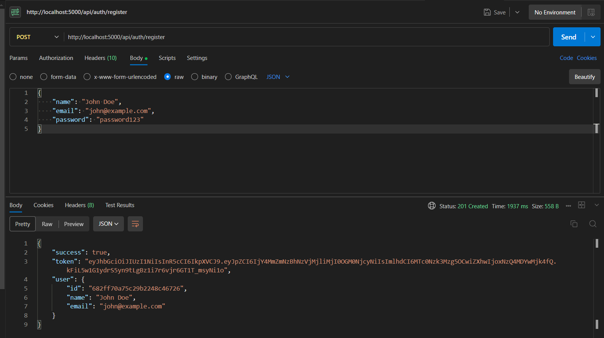
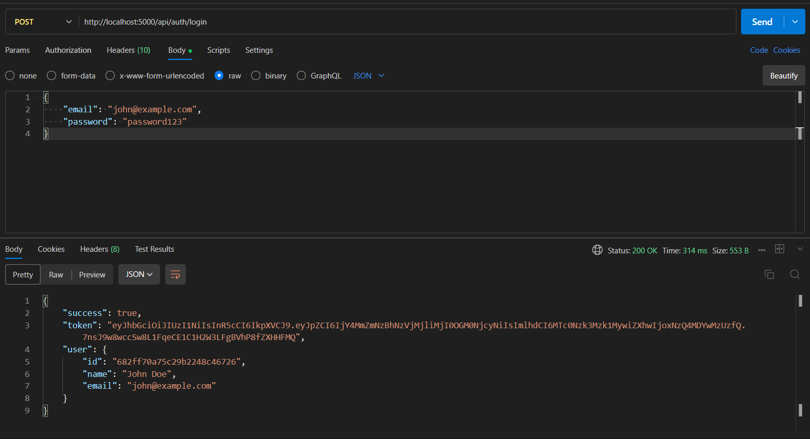
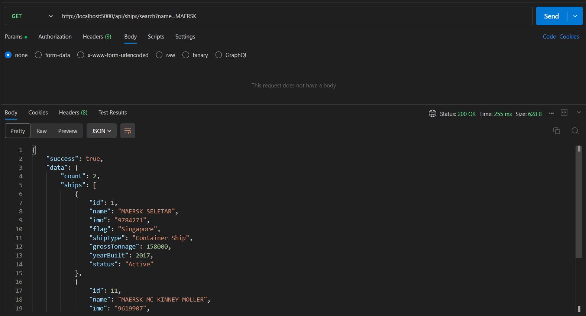

Maritime Operations Dashboard
A full-stack application featuring a secure authentication system, responsive dashboard UI, and maritime data integration.
Project Overview
This project is a Maritime Operations Dashboard that allows users to:

Register and login with secure authentication
View maritime data through an intuitive dashboard interface
Search for ships by name and view their details

Technology Stack
Backend

Node.js
Express.js
MongoDB (database)
JWT for authentication
bcrypt for password hashing

Frontend

React
Tailwind CSS
Chart.js for data visualization
React Router for navigation
Axios for API calls

Project Structure
maritime-dashboard/
├── README.md
├── maritime/                  # Frontend (React)
│   ├── public/
│   ├── src/
│   │   ├── components/
│   │   ├── pages/
│   │   ├── services/
│   │   ├── utils/
│   │   ├── App.js
│   │   ├── index.js
│   ├── package.json
│
├── server/                  # Backend (Node.js)
│   ├── config/
│   ├── controllers/
│   ├── middleware/
│   ├── models/
│   ├── routes/
│   ├── services/
│   ├── server.js
│   ├── package.json
Setup Instructions
Prerequisites

Node.js (v14 or higher)
MongoDB (local or Atlas)

Installation

Clone the repository
git clone https://github.com/Dipanshu-verma/maritime-poject.git
cd maritime-dashboard

Setup Backend
cd server
npm install
Create a .env file in the server directory with the following variables:
PORT=5000
MONGO_URI=mongodb://localhost:27017/maritime-dashboard
JWT_SECRET=your_jwt_secret_key
JWT_EXPIRE=24h

Setup Frontend
cd ../maritime
npm install

Running the Application

Start Backend Server
cd server
npm run dev

Start Frontend Development Server
cd client
npm start

Access the Application

Frontend: http://localhost:3000
Backend API: http://localhost:5000

API Endpoints
Authentication

POST /api/auth/register - Register a new user

Body: { "name": "John Doe", "email": "john@example.com", "password": "password123" }

POST /api/auth/login - Login a user

Body: { "email": "john@example.com", "password": "password123" }

GET /api/auth/profile - Get user profile (requires authentication)

Ships

GET /api/ships/search?name=SHIPNAME - Search for ships by name (requires authentication)

